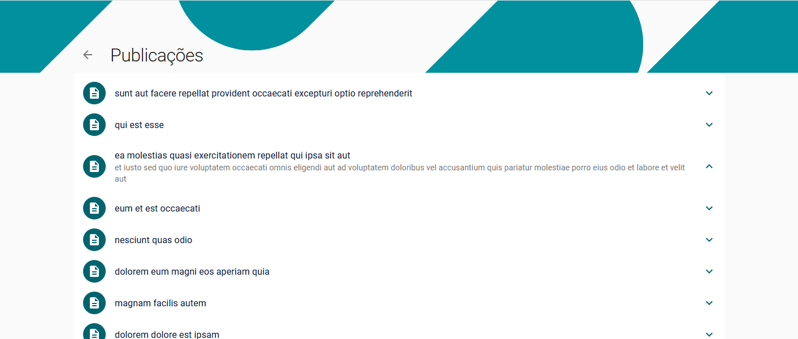

# Growth Tech Challenge - Fullstack Developer

This is a project that pulls data from [JSONPlaceholder](http://jsonplaceholder.typicode.com) and lists it.

Main dependencies:

- Typescript
- Express
- Material UI
- Styled Components
- Axios

Here are some of the pages:

# The challenge

Uma empresa deseja realizar um monitoramento de outros grupos empresariais em um site X para analisar seus posts. Sua tarefa é criar uma simples API que captura apenas os usuários (http://jsonplaceholder.typicode.com/users) os quais a empresa em que trabalham fazem parte de um grupo e exiba seus posts (http://jsonplaceholder.typicode.com/posts) unido do nome do funcionário e sua empresa. Além disso criar uma tela para facilitar a leitura desses posts.

- O backend obrigatoriamente precisa ser realizado com Express.js.
- O frontend obrigatoriamente precisa ser realizado com React.js.
- Apesar de bem simples, o projeto precisa estar pronto para produção.
- Sinta-se à vontade para adicionar mais features e criar uma UI maneira!
